# CS 216: Bitcoin Transaction Lab

**Team HighOnByte** | 2nd Programming Assignment | March 2026

| Name | Roll Number |
|------|------------|
| Aastha | 240004001 |
| Bhavika Jaiswal | 240001017 |
| Sanskriti Jain | 240001064 |
| Suhani | 240001077 |

---

## Overview

This project implements and compares two types of Bitcoin transactions on a local **regtest** network using Python and Bitcoin Core RPC.

The lab demonstrates how Bitcoin scripts work by manually decoding:

- **scriptPubKey (challenge script)**
- **scriptSig (response script)**
- **witness data (SegWit)**

and verifying them step-by-step using **btcdeb**.

The workflow is divided into four parts.

### Part 1a — Legacy P2PKH

1. Generate 3 legacy addresses **A, B, C**
2. Fund address **A** with 1 BTC
3. Create transaction **A → B**
4. Decode the **scriptPubKey (challenge script)**

### Part 1b — Spending the UTXO

1. Use `listunspent` to locate the UTXO at **B**
2. Create transaction **B → C**
3. Decode the **scriptSig (response script)**
4. Verify challenge–response matching

### Part 2 — SegWit (P2SH-P2WPKH)

Repeat the same workflow using SegWit wrapped in P2SH — addresses `A' → B' → C'` — but with:

- **scriptSig containing only redeemScript**
- **signature and pubkey stored in witness**

### Part 3 — Comparison

Compare both transaction types: raw size, virtual size, weight, and script structure.

---

## Key Result

| Metric | P2PKH (B→C) | SegWit (B'→C') | Savings |
|--------|-------------|----------------|---------|
| Size (bytes) | 191 | 215 | SegWit larger raw |
| vSize (vbytes) | 191 | 134 | **29.8% smaller** |
| Weight (WU) | 764 | 533 | **30.2% smaller** |

Even though SegWit transactions are larger in raw bytes, they are cheaper because **witness data receives a 75% weight discount**.

---

## Prerequisites

- Ubuntu 22.04 (or WSL2)
- Bitcoin Core 26.0
- Python 3.10+
- btcdeb

---

## Setup

### Install Bitcoin Core

```bash
wget https://bitcoincore.org/bin/bitcoin-core-26.0/bitcoin-26.0-x86_64-linux-gnu.tar.gz
tar -xzf bitcoin-26.0-x86_64-linux-gnu.tar.gz
sudo install -m 0755 -o root -g root -t /usr/local/bin bitcoin-26.0/bin/*
```

### Configure Bitcoin

```bash
mkdir -p ~/.bitcoin
cat > ~/.bitcoin/bitcoin.conf << 'CONF'
regtest=1
server=1
txindex=1

[regtest]
rpcuser=student
rpcpassword=cs216bitcoin
rpcport=18443
rpcbind=127.0.0.1
rpcallowip=127.0.0.1
paytxfee=0.0001
fallbackfee=0.0002
mintxfee=0.00001
txconfirmtarget=6
CONF
```

### Start Bitcoin and Create Wallet

```bash
bitcoind -daemon
sleep 5
bitcoin-cli createwallet "lab_wallet"
bitcoin-cli generatetoaddress 101 $(bitcoin-cli getnewaddress)
bitcoin-cli getbalance
```

The first 101 blocks are required because coinbase rewards need 100 confirmations before they can be spent.

### Install Python Dependencies

```bash
python3 -m venv venv
source venv/bin/activate
pip install python-bitcoinrpc
```

### Install btcdeb

```bash
sudo apt install -y autoconf libtool pkg-config libssl-dev git make g++
git clone https://github.com/bitcoin-core/btcdeb.git
cd btcdeb
./autogen.sh
./configure
make -j$(nproc)
sudo make install
```

---

## Running the Code

Activate the virtual environment first:

```bash
source venv/bin/activate
```

Run scripts **in order** — each script saves state that the next one reads:

```bash
# Part 1a — generate addresses, fund A, send A→B
python3 p1_addr_and_send.py

# Part 1b — listunspent at B, send B→C, decode scripts
python3 p1_spend_b.py

# Part 2 — SegWit A'→B'→C'
python3 p2_segwit.py

# Part 3 — size and script comparison
python3 p3_compare.py
```

Each script prints decoded scripts, TXIDs, and transaction sizes to the terminal, and saves results to a `*_summary.json` file.

---

## Addresses Generated

### Legacy P2PKH

| Label | Address |
|-------|---------|
| A | `mgdUJzJhqrZo9vKT3B2AcrZ81bngpJKrN6` |
| B | `mtJpEisXAjwimoBzEKVGBYFqr8Uot4P4PV` |
| C | `n4d6oYbGNvWSo2LsbsbtwCp8mknwnMW74S` |

### SegWit P2SH-P2WPKH

| Label | Address |
|-------|---------|
| A' | `2MwDLiQDFFdMTGNcoZNFJdzbWyZ5cGuSHwB` |
| B' | `2Mws7da6CgS6HDuzBHtvixvz2awkQ5haTRG` |
| C' | `2N8gyrug6h3uMr51cFdR91VkeJ5tBWv6vC8` |

---

## Transaction IDs

### Legacy P2PKH

| Transaction | TXID |
|-------------|------|
| Fund → A | `1df07c77d16e8f3ec642867864e37617a1febc3902426b44ba276152c7652afc` |
| A → B | `fafa0abb7b9126b6fae7bba7d0d24174491726a214ec4a00ca73f65396ab354c` |
| B → C | `d532428dc63c82f4b6a5c057e72c9e93ed08384f9ab13e41e02efffd63e2e8c7` |

### SegWit

| Transaction | TXID |
|-------------|------|
| Fund → A' | `a5108f50c7e5d7927b80b6d62e2689e7c9d73791a7c910295d77ef44c52ec6d1` |
| A' → B' | `b92b2ef1b3f4daac1b6bc6da28cf5b46c6d1333f7568308b8dade4e2521bc7c0` |
| B' → C' | `b536bb250cb504ff206fd517a41b9b8595868dee4083942bd699e87a58a61564` |

---

## Script Analysis

### P2PKH Challenge Script (scriptPubKey)

```
OP_DUP OP_HASH160 8c4deaea5fa0ca2798347033d69abb0051af9f24 OP_EQUALVERIFY OP_CHECKSIG
hex: 76a9148c4deaea5fa0ca2798347033d69abb0051af9f2488ac
size: 25 bytes
```

### P2PKH Response Script (scriptSig)

```
<signature> <pubkey>

3044022055ee689066e5bd7ea7d5ec7091d1e4484a1a1ef91d0fc0a13569d5af9ae721f3...
033504f752d213985732db96c47aba8beaeb1e563839965fd44cdfb5562ec94af5

size: ~106 bytes
```

### SegWit Challenge Script (scriptPubKey)

```
OP_HASH160 32aa2bcdb8f5ede4a60b2f300f919aaaf5745796 OP_EQUAL
hex: a91432aa2bcdb8f5ede4a60b2f300f919aaaf574579687
size: 23 bytes
```

### SegWit Response

**scriptSig** (redeemScript only — 23 bytes):
```
0014ffb9dcac2cca1e4ea378498d4f1beda758b771e3
```

**Witness** (segregated, 75% weight discount):
```
[0] signature: 3044022075f0860138569067736ab12bec4ef0fdd18fedb3...
[1] pubkey:    0245085c3e415932ea3eff76b3890388d13a03ff...
```

---

## btcdeb Verification

Both transactions were validated using:

```bash
btcdeb --tx=<spending_tx> --txin=<previous_tx>
```

btcdeb confirms for both P2PKH and SegWit:

```
result: success
final stack: [01]
```

The scripts evaluate to `TRUE` — both transaction chains are valid.

## btcdeb Script Verification

The scripts were validated using btcdeb to trace the execution of the Bitcoin
stack-based script interpreter.

Example command:

btcdeb --tx=<signed_B_to_C_tx> --txin=<A_to_B_tx>

btcdeb allows step-by-step execution of opcodes such as:
OP_DUP
OP_HASH160
OP_EQUALVERIFY
OP_CHECKSIG

### Part 1 — P2PKH Script Execution (8 steps)

| Step | Screenshot | What Happens |
|------|-----------|--------------|
| Initial | 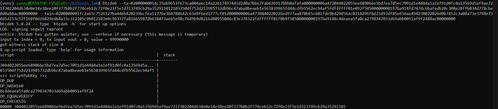 | 8 op script loaded, witness stack size 0 |
| Step 0 | 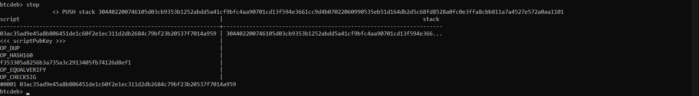 | Signature pushed from scriptSig |
| Step 1 | 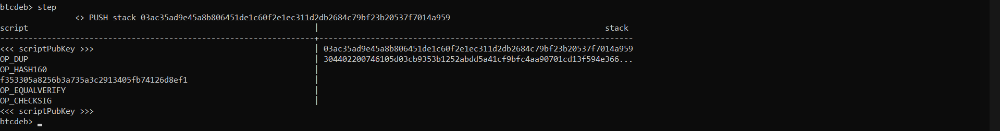 | Public key pushed |
| Step 2 | 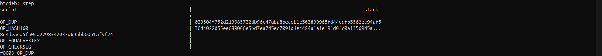 | OP_DUP: pubkey duplicated |
| Step 3 | 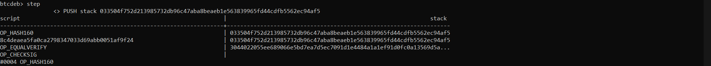 | OP_HASH160: pubkey hashed |
| Step 4 | 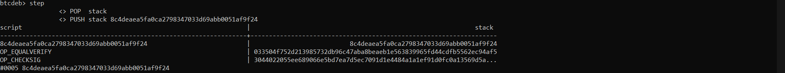 | Expected hash pushed |
| Step 5 | 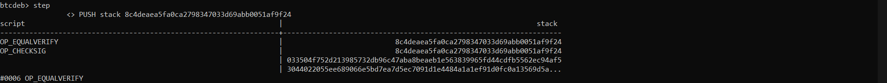 | OP_EQUALVERIFY: hashes match |
| Step 6 | 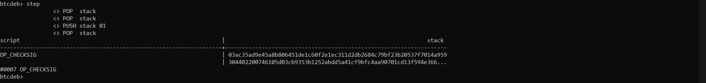 | OP_CHECKSIG executing |
| Step 7 ✅ | 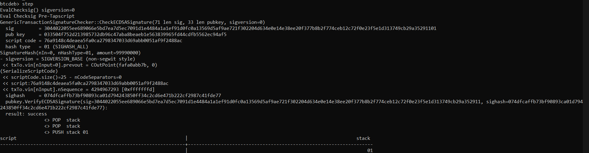 | result: success — stack [01] |

### Part 2 — SegWit Script Execution (5 steps)

| Step | Screenshot | What Happens |
|------|-----------|--------------|
| Initial | 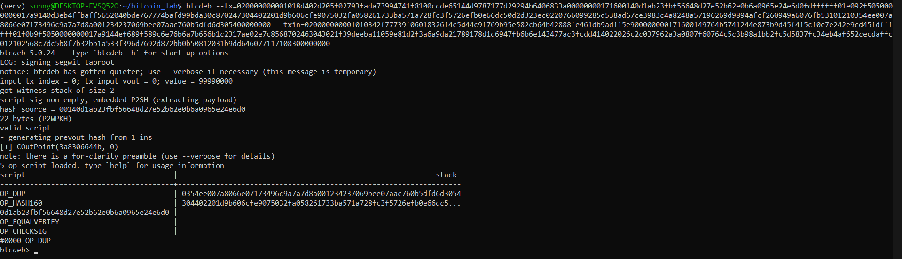 | 5 ops, witness stack 2, P2WPKH extracted |
| Step 0 | 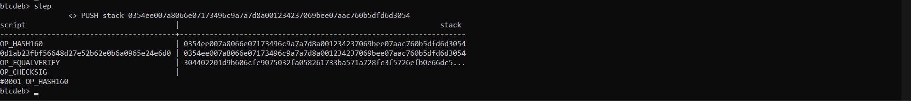 | OP_DUP: pubkey duplicated |
| Step 1 | 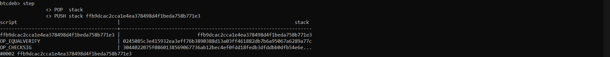 | OP_HASH160: pubkey hashed |
| Step 2 | 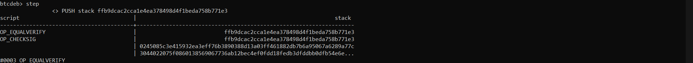 | Expected hash pushed |
| Step 3 | 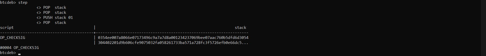 | OP_EQUALVERIFY: hashes match |
| Step 4 ✅ | 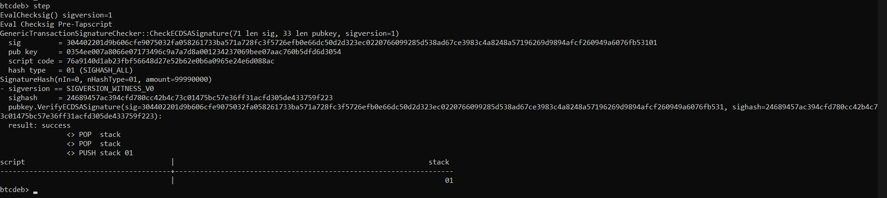 | result: success — stack [01] |

---

## Repository Structure

```
bitcoin-transaction-lab/
├── p1_addr_and_send.py      # Part 1a: generate addresses, fund A, A→B
├── p1_spend_b.py            # Part 1b: listunspent, B→C, script analysis
├── p2_segwit.py             # Part 2: SegWit A'→B'→C'
├── p3_compare.py            # Part 3: size and script comparison
├── p1_state.json            # state passed from Part 1a to 1b
├── part1_summary.json       # Part 1 decoded scripts, TXIDs, sizes
├── part2_summary.json       # Part 2 decoded scripts, TXIDs, sizes
├── part3_summary.json       # comparison output
├── legacy_addrs.json        # generated P2PKH addresses
├── segwit_addrs.json        # generated SegWit addresses
├── screenshots/             # btcdeb execution screenshots
│   ├── p1_btcdeb_00_initial.png
│   ├── p1_btcdeb_01_sig_pushed.png
│   ├── p1_btcdeb_02_pubkey_pushed.png
│   ├── p1_btcdeb_03_OP_DUP.png
│   ├── p1_btcdeb_04_OP_HASH160.png
│   ├── p1_btcdeb_05_hash_pushed.png
│   ├── p1_btcdeb_06_OP_EQUALVERIFY.png
│   ├── p1_btcdeb_07_OP_CHECKSIG_before.png
│   ├── p1_btcdeb_08_OP_CHECKSIG_success.png
│   ├── p2_btcdeb_00_initial.png
│   ├── p2_btcdeb_01_OP_DUP.png
│   ├── p2_btcdeb_02_OP_HASH160.png
│   ├── p2_btcdeb_03_hash_pushed.png
│   ├── p2_btcdeb_04_OP_EQUALVERIFY.png
│   └── p2_btcdeb_05_OP_CHECKSIG_success.png
├── Bitcoin.pdf              # full lab report
└── README.md
```

---

## Network Configuration

| Parameter | Value |
|-----------|-------|
| Network | Regtest (local, no real BTC) |
| RPC Host | 127.0.0.1 |
| RPC Port | 18443 |
| RPC User | student |
| Wallet | lab_wallet |

---

## Conclusion

This project demonstrated:

- how Bitcoin scripts enforce spending conditions
- how UTXO chains work
- how SegWit separates signature data into the witness field
- why SegWit transactions are cheaper to broadcast

SegWit reduced transaction cost by ~30% while preserving security and backward compatibility.
